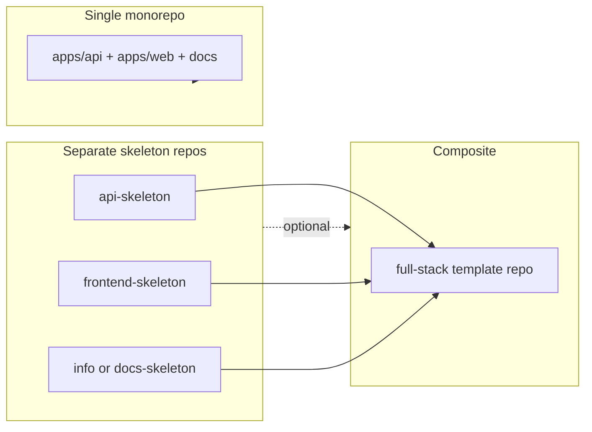
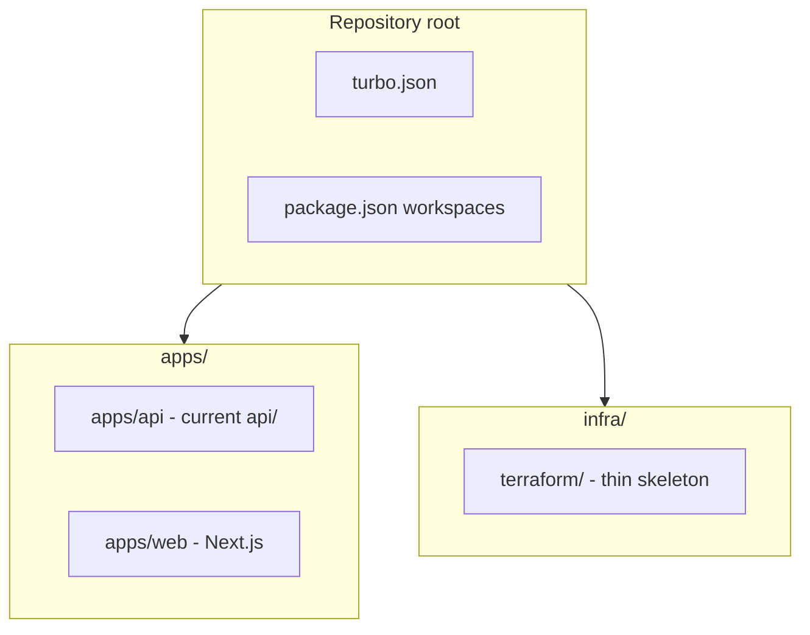

# Monorepo (Turborepo) + Next.js + Terraform skeleton

## Monorepo capabilities vs separate template skeletons

This section is **decision support** (not implementation): it maps your idea—**API skeleton + frontend skeleton + “info” skeleton + a final composite**—to realistic options.

### What a monorepo buys you (as a template author)

- **One clone, one CI pipeline** that can build/test multiple apps with shared caching (e.g. Turborepo remote cache).
- **Atomic changes** across API and web (e.g. contract or route change in one PR).
- **Shared dev tooling** at the root: one ESLint/Prettier/TS version, consistent scripts.
- **Optional internal packages** later (`packages/shared`, OpenAPI-generated clients) without publishing to npm first.

Tradeoffs:

- **Cognitive load**: newcomers see more folders than a single-app repo.
- **“API-only” consumers** still inherit the full tree unless you add **path-filtered CI**, **generators**, or **separate repos**.
- **Versioning**: one repo usually means one release line unless you use tags per “product” or split packages clearly.

### What “template skeletons” mean in practice

| Approach | What it is | Best when |
| -------- | ---------- | --------- |
| **GitHub Template repos** | Fork-friendly starting points | You want zero tooling; users copy and own the repo |
| **Generators** (Plop, Hygen, custom CLI, `create-*`) | Prompts produce only the pieces you need | You want API-only vs full-stack **without** manual deletes |
| **Monorepo with filters** | Everything present; daily work uses `turbo run --filter=...` | Team builds full-stack often; occasional API-only is fine |
| **Git submodules / subtrees** | Composite repo pins versions of other repos | You maintain **separate** canonical repos and assemble releases |

### Your four-piece model: separate vs composite vs “delete the folder”

1. **Separate repos (API, frontend, info) + a fourth “full” repo that pulls them together**  
   - **Pros**: Each artifact stays **minimal**; an API-only user never clones Next.js or Terraform. Clear ownership per repo.  
   - **Cons**: **Drift** (three places to bump TypeScript, ESLint, patterns). The “full” repo needs a **sync story**: scripted copy, subtree merge, submodules, or npm packages for shared conventions. **Highest maintenance** unless you automate.

2. **Develop everything in one monorepo from day one**  
   - **Pros**: **Single source of truth**; Turborepo and CI stay simple.  
   - **Cons**: Pure API users must ignore `apps/web` or you invest in **generators** / **template branches** / **path-based CI** so they don’t pay for web in every job.

3. **“Leave `web` empty or delete it if I only need an API”**  
   - **Empty folder**: Usually worse than deleting—you still have workspace entries, lockfile noise, and mental overhead.  
   - **Delete folder**: Works for a **one-time fork**, but it is **easy to get wrong** (broken `turbo.json`, workspaces, CI). **Not ideal** as the primary story for a reusable template unless documented as a checklist.

### Suggestions for how to move forward

- **If this repo’s main value is the DDD API** (your current strength): keep **`api-ddd-template`** (or a renamed equivalent) as the **canonical API skeleton**. Add web/infra either **here** as optional apps **or** in a second repo that **documents** “copy `apps/api` layout from X” or uses **subtree** when you cut a release.  
- **If you want one “golden path” full-stack template** for yourself or a small team: a **single Turborepo** with `apps/api`, `apps/web`, `infra/` is simpler than four repos—use **`turbo run --filter=@repo/api`** for API-focused work and **CI path filters** so pushes that only touch `apps/api` don’t build Next.js.  
- **“Info skeleton”** (handbook, ADRs, contributing, architecture): often **`docs/` inside the API or monorepo root** is enough; a **separate docs-only repo** pays off for **organization-wide** content reused across many projects, not one product.  
- **Composite fourth repo** is most valuable when you **already** maintain separate open-source or internal templates and need a **kitchen-sink** bundle for new services—otherwise it can be **overkill** for a solo maintainer without automation.

### How this connects to the technical plan below

The steps in this document (workspaces, `apps/api`, `apps/web`, `infra/terraform`, Turbo CI) assume a **single-repo monorepo**. If you choose **strict separation** (multiple skeleton repos), reuse the **same layout ideas** inside each repo and only merge them in a **composite** repo or generator—**do not** duplicate ADR/agent content in four places without a sync plan.

After you settle **distribution** (one repo vs many vs generator), you can answer the open questions in the original plan (e.g. breaking layout, tags, CI scope) with less ambiguity.

### Preference recorded (2025-03)

- **Primary consumer**: solo / personal projects. **Lean**: a **single golden-path monorepo** (Turborepo: `apps/api`, `apps/web`, `infra/`) with `turbo run --filter=@repo/api` when you only touch the API; **avoid** maintaining four separate skeleton repos unless you later need public templates or org-wide splits. You can still extract a repo later with `git subtree split` if needed.

## What the git history shows

There are **four commits** on a short, linear history:

| Commit    | Summary                                |
| --------- | -------------------------------------- |
| `2432638` | Initial DDD API template skeleton      |
| `0b5eff9` | Agents scaffold and documentation      |
| `53485da` | Example domain (replaced prior domain) |
| `7630524` | Agent framework enhancements           |

There is **no prior monorepo or infra work**—the root is already a **dual-package** setup (`[package.json](package.json)` at root with Jest + TS; `[api/package.json](api/package.json)` for Express) and CI runs **two `npm install` steps** (`[.github/workflows/ci.yml](.github/workflows/ci.yml)`). Moving to workspaces + Turborepo is a natural next step rather than fighting an existing Nx/Lerna setup.

## Target layout (recommended)

- `**apps/api**`: Relocate today’s `[api/](api/)` tree here (same DDD structure, `[Container](api/infrastructure/)`, Jest still at root or moved—see below).
- `**apps/web**`: New Next.js app (App Router, TypeScript). Default: **no shared internal packages** until you need them; add `packages/` later for shared types or UI.
- `**infra/terraform`**: Thin skeleton: `versions.tf` (Terraform + provider block with placeholder or `null`), `variables.tf`, `outputs.tf`, optional `modules/` stub, `README` describing how to add AWS/GCP/Azure when decided. **No cloud-specific resources** until you pick a provider (matches your “undecided” choice).

**Alternative layout** (less churn): keep `**api/` at repository root** and add `**apps/web`** only. That avoids mass-import and Jest path rewrites but is **less conventional** for Turborepo and may confuse new contributors. For a **template** repo, `apps/api` + `apps/web` is usually clearer.

## Turborepo wiring

- Root `[package.json](package.json)`: `"workspaces": ["apps/*", "packages/*"]` (even if `packages/` is empty initially), add `**turbo`** devDependency, scripts like `"build": "turbo run build"`, `"dev": "turbo run dev"`, `"lint": "turbo run lint"`.
- Add `[turbo.json](turbo.json)` with pipelines for `build`, `lint`, `test`, `type-check` as needed; declare `**dependsOn: ["^build"]**` only if you introduce dependent packages later.
- **Next.js app**: standard `next build` / `next dev`; optional `transpilePackages` if you later add shared packages.

## API + Jest + `@api/` paths

Root Jest maps `^@api/(.*)$` → `apps/api/$1`, with matching `paths` in root `tsconfig.json` for editor and `tsc --noEmit` on `test/`.
- Update root scripts that use `cd api` to `**turbo run**` or `**npm run -w api**` style (exact naming depends on workspace package name, e.g. `@repo/api`).

**Naming**: Prefer scoped names like `@repo/api` and `@repo/web` in each app’s `package.json` for clarity in a template.

## CI (`[.github/workflows/ci.yml](.github/workflows/ci.yml)`)

- Single checkout; `**npm install`** at root (workspaces install children).
- Cache **Turborepo** (and optionally **Next.js** build cache) via `actions/cache` or a maintained action; run `**npx turbo run build lint test type-check`** (or equivalent tasks you define).
- Keep **Node matrix** (18/20) or simplify to one LTS if build times matter; Turborepo caching reduces duplicate work.
- **Terraform**: add a **format + validate** job (or step) that runs `terraform fmt -check` and `terraform validate` from `infra/terraform` **only when** `.tf` files change (path filter), or always if you want strictness on a small skeleton.

## Terraform skeleton content (minimal, provider-agnostic)

- `README.md` in `infra/terraform`: state backend choice (local vs remote), workspace naming, and “when you pick AWS/GCP/Azure, add provider + modules here.”
- Optional: **Makefile** or npm script at root: `infra:fmt`, `infra:validate` wrapping Terraform CLI.
- **Do not** commit secrets; document `TF_VAR_*` / CI OIDC pattern for later.

## Same repository vs new repository

**Incorporate into this repository** if:

- You want **one** “full-stack DDD template” artifact (API + web + infra) and are OK treating the layout change as a **breaking v2** for anyone who forked the old paths (`api/` at root).
- You are willing to update **root README**, **AGENTS.md** references, and any **agent prompts** that assume `api/` only at top level.

**Create a new repository** if:

- You must keep `**api-ddd-template`** as a **minimal, API-only** template for consumers who do not want Next.js or Terraform.
- You want to **compose** multiple upstream skeletons without merging histories (e.g. keep this repo unchanged and generate a monorepo from `create-turbo` + copy API tree).

**Practical middle ground**: Same repo, but use **tags/releases**—e.g. `v1.x` = API-only layout (last tag before monorepo), `v2.x` = monorepo—so forks can pin.

## Using other skeleton repositories

- **Next.js**: Start from official `**create-next-app`** (App Router + TS); align ESLint/Prettier with the API app to avoid style drift.
- **Turborepo**: Official `**create-turbo`** examples mirror `apps/web`, `apps/docs`, `packages/ui`—good reference for `turbo.json` and CI, even if you only have two apps initially.
- **Terraform**: Prefer **HashiCorp docs** + **official provider modules** (e.g. `terraform-aws-modules/`*) **when** you choose a cloud—not a separate “skeleton repo” required for the thin layer you want now.

## Risks / follow-ups (non-blocking)

- **Port conflicts**: API default `3000` vs Next.js `3000`—set Next to `3001` or document `PORT` / `next dev -p` in root README.
- **Shared types**: Optional later `packages/shared` or OpenAPI-generated client; not required for “basic” Next.js.
- **Docker**: Add `Dockerfile` per app or root compose **after** monorepo layout stabilizes if deployment needs it.

## Suggested implementation order

1. Add workspaces + Turborepo at root; verify existing API still builds/tests **before** moving directories (or move once in a single PR).
2. Move `api` → `apps/api` (or adopt `apps/web` first with `api` at root, then move API in a second PR—your choice for blast radius).
3. Scaffold `apps/web` with Next.js; wire `turbo` pipelines.
4. Add `infra/terraform` skeleton + CI validate/fmt.
5. Update documentation (README, AGENTS, CI badge if any) and consider **CHANGELOG** + **v2** release note.

No code changes are included in this plan; this is the roadmap only.