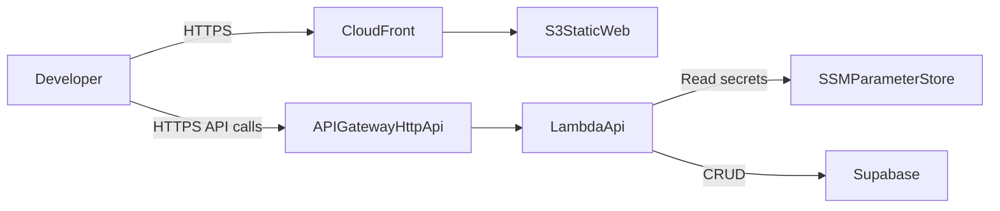

# Zero-Cost-First E2E Deployment Plan

## Goal

Validate the skeleton end-to-end with a public AWS URL and Supabase-backed CRUD, while optimizing for near-zero default spend and strict cost guardrails.

## Strategy shift

- Move from App Runner-first to serverless-first for the initial validation track.
- Keep Supabase as the default persistence path.
- Treat always-on hosting as an explicit later upgrade path.

## Why this aligns with your goal

- App Runner is simple, but it does not naturally hit true zero idle cost unless paused aggressively.
- Serverless components can reduce idle baseline substantially for low-traffic test and early apps.
- We can still keep an App Runner option documented as a future "easy always-on" mode.

## Architecture (zero-cost-first)

## Implementation phases

### Phase 1: Supabase-first API path

- Replace in-memory runtime wiring with Supabase-backed repository as default in the main template flow.
- Keep DDD interfaces unchanged (`IThingRepository`, use cases, controllers).
- Add strict startup validation for required Supabase config.
- Introduce an explicit adapter layer for external services so repositories do not call service SDK/HTTP clients directly.
- Implement `SupabaseAdapter` as the single integration point for Supabase API calls and configuration.
- Refactor `ThingRepository` to use `SupabaseAdapter`, keeping repository focused on domain mapping and persistence semantics.

Likely file layout:

- `apps/api/infrastructure/adapters/ThingDataAdapter.ts`
- `apps/api/infrastructure/adapters/supabase/SupabaseAdapter.ts`
- `apps/api/infrastructure/repositories/ThingRepository.ts` (uses adapter)
- `apps/api/infrastructure/container.ts` (wires adapter + repository)

### Phase 2: Serverless AWS hosting baseline

- Deploy API as Lambda + API Gateway HTTP API.
- Deploy web as static export to S3 + CloudFront (or keep web local for first API-only validation pass).
- Wire API to Supabase credentials via SSM and IAM least privilege.

#### Phase 2 implementation detail: Express on Lambda

- Lambda function will host the Express app (single function for API), and API Gateway will invoke Lambda for each HTTP request.
- Use a lightweight adapter layer (for example, `@vendia/serverless-express`) so API Gateway events are translated into Express `req`/`res`.
- Keep current route/controller/use-case structure intact; deployment wiring changes, not DDD boundaries.
- Add a Lambda entrypoint (for example, `apps/api/lambda.ts`) that initializes the Express app once per container lifecycle and reuses it across warm invocations.
- For cold starts and latency, keep bundle size small and avoid expensive startup work in module scope.

#### What API Gateway invokes

- API Gateway does **not** call individual use-cases directly.
- API Gateway invokes Lambda.
- Lambda runs Express routing, and Express dispatches to controllers/use-cases.
- This keeps local dev behavior and cloud behavior aligned.

#### If we later switch to a Lambda-friendlier server framework

- **Fastify (+ Lambda adapters)**: generally lower overhead than Express, good migration path.
- **Hono**: very lightweight and runtime-portable (Lambda/edge/serverless).
- **AWS Lambda Web Adapter style runtimes**: keep web framework flexibility while optimizing Lambda hosting model.
- **Native Lambda handlers per route**: best cold-start control, but highest refactor cost and weaker parity with existing Express app.
- Decision point: if p95 latency or cold starts become unacceptable, prioritize Fastify or Hono before rewriting into route-per-function handlers.

### Phase 3: Cost guardrails baked in by default

- Add AWS Budgets with alert thresholds (e.g., $1 / $5 / $10 monthly).
- Add service quotas and limits where possible to prevent runaway scale.
- Add automated idle controls:
  - scheduled disable/teardown for non-prod environments,
  - one-command resume/redeploy for test windows.
- Keep default environment in low-cost region and minimal sizing.

### Phase 4: E2E CRUD smoke validation

- Add smoke script for create/list/get/update/delete on `Thing` against public URL.
- Run smoke checks in deployment workflow and fail on first regression.
- Add post-test teardown step to return environment to near-zero baseline.

### Phase 5: Optional no-database variant (separate path)

- Define a separate, explicit no-db starter variant (branch/generator mode).
- Do not mix no-db fallback behavior into primary DB-first runtime path.

### Phase 6: Documentation and operator safety

- Document default flow: zero-cost-first serverless + Supabase.
- Document "always-on" upgrade path (App Runner or ECS) for later.
- Add clear runbook: deploy, smoke test, auto-pause/teardown, resume.
- Update `AGENTS.md` conventions to require adapters for external services (Supabase, AWS SDK, third-party APIs) and clarify repository-to-adapter dependency direction.

## Cost model guidance for App Runner (for comparison)

- App Runner pricing is based on provisioned memory plus active CPU/memory usage; it is not a pure scale-to-zero runtime by default.
- Costs can be controlled with max instances and pause/resume, but always-on mode introduces a baseline charge.
- If your first objective is "as close to free as possible out of the box," serverless-first is the safer default.

References:

- [AWS App Runner pricing](https://aws.amazon.com/apprunner/pricing/)
- [AWS App Runner FAQs](https://aws.amazon.com/apprunner/faqs/)
- [AWS App Runner quotas](https://docs.aws.amazon.com/general/latest/gr/apprunner.html)

## Acceptance criteria

- Fresh clone can deploy public API URL and complete Supabase CRUD smoke test.
- Default non-prod setup returns to near-zero idle spend via auto-pause/teardown behavior.
- Budget alerts and caps are enabled by default.
- DB-first path is the canonical template behavior; no-db path is separate and explicit.

