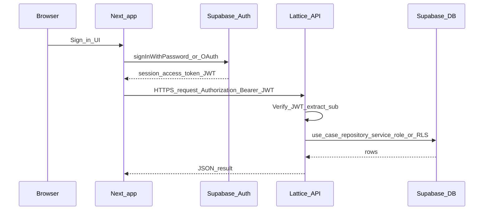

# Research: How to connect the app to Supabase (client vs API vs ORM)

This note compares **three common ways** teams wire Supabase into a stack, in the context of **Lattice**: a **DDD API** (`@lattice/api`) with **repository adapters**, a **Next.js** client (`@lattice/web`), and **infrastructure-as-code** for deployment. It is **not** an ADR; it supports deciding whether to follow Supabase’s “connect from Next” wizard or stay aligned with the template.

If you want the **recommended security-first default** for auth (optimized for reusable Lattice forks), see [Security-first default: Supabase Auth with API boundary](./supabase-auth-security-first.md).

## Terms

| Phrase | Meaning here |
|--------|----------------|
| **Supabase client in the browser** | `@supabase/supabase-js` in Next **Client Components** (or similar), using the **anon** key and **Row Level Security (RLS)** for authorization. |
| **Direct connection (template path)** | The **API** talks to Supabase using the **service role** (or a server-only secret) over **PostgREST** (`/rest/v1/...`), as in [`SupabaseAdapter`](../../apps/api/infrastructure/adapters/supabase/SupabaseAdapter.ts). The browser talks only to **your Express API**, not to Postgres credentials. |
| **ORM** | e.g. **Prisma**, **Drizzle**, or **Kysely** talking to Postgres (often via Supabase’s **connection string** or pooler), usually **on the server**, not in the browser. |

---

## 1. Supabase from the Next.js client (anon key + RLS)

**What it is:** Supabase’s dashboard and docs often prompt you to add the JS client to a frontend, set `NEXT_PUBLIC_SUPABASE_URL` and `NEXT_PUBLIC_SUPABASE_ANON_KEY`, and query tables or Auth from React.

### Strengths

- **Speed to first query:** Read/write from the UI without building API routes first.
- **First-class Auth + Realtime:** Session handling, OAuth, and channels fit the client SDK well.
- **RLS as the security model:** If policies are correct, you can avoid exposing the service role anywhere.

### Weaknesses

- **Domain logic splits:** Rules that belong in **use cases** and **aggregates** tend to drift into **RLS policies**, **Edge Functions**, or **client code**—harder to test as one domain model.
- **Two backends in practice:** Anything that must stay secret (service role, business-only operations) still needs a **server** path—so you often end up with **both** client Supabase **and** an API.
- **Template mismatch:** Lattice’s **tests and boundaries** center on **HTTP → controller → use case → repository**. Client-side Supabase calls **bypass** that chain for whatever you wire directly.
- **Static / CDN hosting:** A **static-export** web app cannot hold secrets; only **public** keys are possible in the bundle—design must assume **RLS** for every table the client touches.

### Caveats for **this** template specifically

- **ADR-004 / repository pattern:** Persistence is intentionally behind **`IThingRepository`** and adapters. Browser-direct Supabase is a **second persistence path** unless you only use it for **Auth** or **read-only** edge cases and still route **Thing** (and similar) data through the API.
- **Operational story:** Your **Terraform / Lambda / API Gateway** work targets the **API**. Traffic that hits Supabase **only** from the browser **does not** go through that gateway—monitoring, throttling, and versioning differ per path.
- **“I should have set this up earlier”:** Choosing the client SDK **now** doesn’t invalidate the API; it means **explicitly deciding** what is **API-owned** vs **client-owned** (e.g. Auth + profile in Supabase, **Things** via API).

---

## 2. “Direct connection” through the API (current template design)

**What it is:** The **Express** app uses a **server-side** Supabase URL and **service role** (or a narrow server key) inside [`SupabaseAdapter`](../../apps/api/infrastructure/adapters/supabase/SupabaseAdapter.ts). The **Next** app uses **`NEXT_PUBLIC_API_URL`** and never sees database secrets.

### Strengths

- **Single place for rules:** Controllers + use cases + **one** repository implementation per aggregate (easy to mock in tests).
- **Consistent with Lattice:** Matches **Jest** integration tests, **OpenAPI**, and future **Lambda** deployment.
- **Secrets stay server-side:** Service role never ships to the browser.

### Weaknesses

- **Latency:** Every action is an extra hop (browser → API → Supabase).
- **You own the API surface:** You maintain routes, validation, and versioning; Supabase’s auto-REST is **not** exposed to the client directly.

### Caveats for the template

- **Local dev:** Without `.env`, the template can fall back to **in-memory** storage (see [`apps/api/AGENTS.md`](../../apps/api/AGENTS.md)); **production** expects real Supabase env vars on the API.
- **Not “wrong” to add RLS anyway:** Some teams still enable **RLS** on tables and use the **service role** only from trusted servers—defense in depth. The important part is **not** exposing the service role to clients.

---

## 3. ORM (Prisma, Drizzle, Kysely, …) against Postgres

**What it is:** A **typed** data access layer, often using Supabase’s **Postgres connection string** (direct or pooler), running in **Node** (API process, server actions, or a worker)—**not** in the static browser bundle.

### Strengths

- **Migrations and schema as code:** Strong fit for **evolving** schemas and **team workflows**.
- **Portable SQL:** Easier to move off Supabase-specific PostgREST if you ever need to.
- **Rich queries:** Joins and transactions without hand-rolling REST paths.

### Weaknesses

- **Another layer:** You still map **ORM models → domain entities**; DDD discipline is required or you get an “anemic DB schema” driving the domain.
- **Overlap with PostgREST:** The template already uses **HTTP** to Supabase REST; an ORM replaces **that** adapter, not necessarily the need for an **API** boundary.

### Caveats for the template

- **Not required** for parity with “Supabase”: the current **adapter** is deliberate and small. Introduce an ORM when **migration tooling** or **complex queries** justify the cost.
- **If you add one:** Prefer it **inside** `apps/api` **infrastructure** (new adapter implementation of `IThingRepository`), not in the Next client, to preserve the same **use case** surface.

---

## 4. Safe auth layer: Supabase Auth + separated API and client

This section explains how to use **Supabase Auth** for sign-in/sign-up while keeping **Lattice’s** split: **Next** owns UX and tokens, **Express** owns authorization and domain rules, **Supabase** remains identity + database.

### Roles of each piece

| Layer | Responsibility |
|-------|------------------|
| **Supabase Auth** | Identity: users, sessions, OAuth, JWT **access tokens** (and refresh). |
| **Next.js client** | Login UI, holding the session (memory, `localStorage`, or cookies via `@supabase/ssr` if you move beyond static export). **Never** holds the **service role** key. |
| **Lattice API** | **Verify** every request that mutates domain state; run **use cases**; call Postgres via **service role** in the adapter (today) or a **user-scoped** PostgREST path (advanced). |

Separation means: **authentication** (“who is this JWT?”) can be delegated to Supabase; **authorization** (“may this user do X to this Thing?”) lives in **your API** (use cases + optional role checks), not only in the browser.

### What “safe” means here

1. **The API does not trust headers or body fields** like `userId: "..."` from the client without a **cryptographically verified** identity.
2. **The browser only ever sees** the **anon** key (for Auth) and **public** URLs — same as Supabase’s client model.
3. **The service role** stays on the **server** (`apps/api` / Lambda). It is **not** a replacement for checking user identity on each request; it is **database access** after you have already decided the request is allowed.

### Recommended request flow

1. **User signs in** (Supabase Auth in the browser or via redirect) → client receives a **session** with an **access token** (JWT).
2. **Calls to your API** include `Authorization: Bearer <access_token>` (or a cookie pattern that your API can resolve to the same JWT).
3. **Express middleware** (outside the template today — you add it) verifies the JWT:
   - Use Supabase’s **JWT secret** (symmetric, in `apps/api` env) with `jsonwebtoken` / `jose`, **or**
   - Validate **issuer** / **audience** and signature per [Supabase JWT docs](https://supabase.com/docs/guides/auth/jwts).
4. **Attach identity to the request** (`req.user = { id: sub, email }`) and pass into controllers / use cases.
5. **Repository** continues to use the **service role** only **after** the API has decided the operation is permitted — or you refactor the adapter to send the **user JWT** to PostgREST so **RLS** enforces row access (see *Caveat: service role vs user JWT* below).

### What not to do

| Anti-pattern | Why it fails |
|--------------|--------------|
| **Service role in Next** (`NEXT_PUBLIC_*` or any client bundle) | Full database bypass; **never** do this. |
| **Trust `X-User-Id` without JWT** | Anyone can forge the header. |
| **Only RLS, no API checks, with service role in API** | Service role **bypasses RLS** — your API must enforce rules in code or use a user-scoped token to Postgres. |
| **Supabase Auth in client but no JWT on API** | “Logged in” in UI but API is **open** or uses a shared service identity — wrong for multi-tenant safety. |

### Caveat: service role vs user JWT to Postgres

The template’s [`SupabaseAdapter`](../../apps/api/infrastructure/adapters/supabase/SupabaseAdapter.ts) uses the **service role**, which **bypasses RLS**. That is acceptable **only if** every sensitive path checks **authorization in the API** (use cases) after JWT verification.

If you want **RLS as a second line of defense**, you typically:

- Either **create a Supabase client with the user’s `access_token`** for that request (PostgREST runs as the user), **or**
- Use **two adapters**: one for admin jobs (service role), one for user-scoped queries (user JWT).

Both are valid; they are **implementation choices** inside `infrastructure/**`, not a reason to put secrets in the browser.

### Next.js + static export (`output: "export"`)

- **Client-side** Supabase Auth + **Bearer** to `NEXT_PUBLIC_API_URL` is the straightforward fit: no server middleware in Next.
- If you later use **SSR** or **Route Handlers**, you can adopt **`@supabase/ssr`** and **httpOnly cookies**; the **API** still validates JWTs the same way (read token from `Authorization` or cookie in middleware).

### API Gateway / Lambda (this repo’s deploy path)

- Prefer **validating JWT in Express** (or Lambda authorizer) so **one** policy: “valid Supabase JWT → allow invoke.”
- Align **issuer** (`iss`) and **audience** (`aud`) with your Supabase project ref so tokens from other projects are rejected.

### Comparison (summary) — updated for auth

| Dimension | Client Supabase SDK | API + adapter (template) | ORM in API |
|-----------|---------------------|---------------------------|------------|
| **Secrets in browser** | Only anon key (RLS required for safety) | No DB secrets | No DB secrets |
| **Fits Lattice DDD + tests** | Poor unless API still owns domain writes | Strong | Strong if repository hides ORM |
| **Supabase Auth** | Natural for login UI; **must** send JWT to API for protected routes | Add JWT middleware + identity in use cases | Same |
| **Operational complexity** | Two paths (client + API) | One API path | One API path + migration tooling |

---

## Practical recommendations for your fork

1. **Default for Things / domain aggregates:** Keep **HTTP → API → repository → Supabase** as the source of truth for **business rules** and **tests**.
2. **Supabase wizard “connect from Next”:** Safe to use for **Auth-only** or **non-domain** features if you accept **dual paths**; avoid putting **service role** or **privileged** keys in `NEXT_PUBLIC_*`.
3. **ORM:** Treat as a **future refactor** of the **adapter layer**, not a reason to bypass the API from the browser.
4. **Documentation:** When you commit to Supabase in production, align **`apps/api/.env`**, **Terraform/SSM**, and **RLS** policies with the **same** trust model (who may call PostgREST with which key).
5. **Auth layer (Supabase Auth + API):** Add **JWT verification middleware** on Express before domain routes; pass **verified `sub`** into use cases; keep **service role** only on the server; never trust client-supplied user IDs without a JWT.

For formal architecture decisions, capture the chosen mix in a new **ADR** once you freeze the split between client Supabase and API-owned data, and **document your JWT verification and env vars** (`SUPABASE_JWT_SECRET` or JWKS URL) in `apps/api/` AGENTS or env docs.

For an opinionated, reusable baseline you can apply across many side projects, use [Security-first default: Supabase Auth with API boundary](./supabase-auth-security-first.md) as the canonical starting point.
