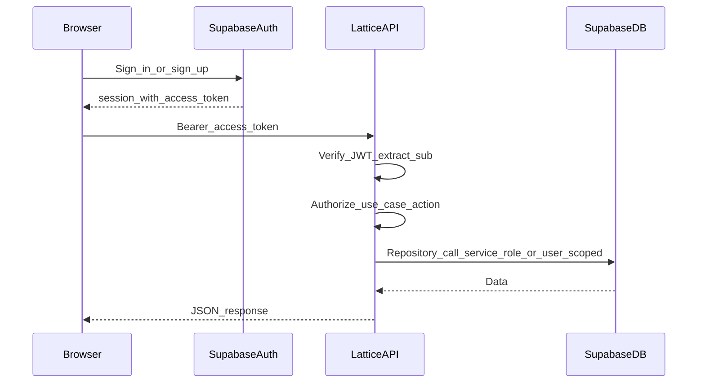

# Security-first default: Supabase Auth with API boundary

This note defines the **recommended default** auth posture for Lattice forks that use Supabase and want strong safety with minimal complexity.

Use this as the baseline unless a project has clear reasons to adopt a more advanced model.

## Default stance

1. **Supabase Auth is the identity provider.**
   - Supabase issues user sessions and access tokens (JWTs).
   - You do not build a parallel auth database for v1.
2. **The Next.js client handles auth UX only.**
   - Client performs sign-in/sign-up and stores session using the Supabase client.
   - Client calls the API with `Authorization: Bearer <access_token>`.
   - Client only uses public Supabase config (`NEXT_PUBLIC_SUPABASE_URL`, `NEXT_PUBLIC_SUPABASE_ANON_KEY`).
3. **The API is the trust boundary for domain behavior.**
   - API verifies JWTs on protected routes.
   - API derives identity from verified claims (`sub`, optionally `email`, etc.).
   - API enforces authorization in controllers/use cases before persistence.
4. **Persistence secrets stay server-only.**
   - Service role key and JWT verification material live in API runtime env only.
   - Never expose privileged keys to browser code.

## Why this is the reusable default for Lattice

- Keeps one clear path for domain data: browser -> API -> repository.
- Preserves DDD boundaries and test strategy in `@lattice/api`.
- Avoids security regressions common in early forks (trusting client user IDs, leaking service role).
- Stays flexible: each project can customize authorization rules without reworking auth foundations.

## Request flow (recommended)

## Minimum API checks

For every protected request:

1. Validate token signature and time claims (`exp`, `nbf` when present).
2. Validate issuer (`iss`) and audience (`aud`) for your Supabase project.
3. Reject missing/invalid token before controller logic.
4. Pass verified user identity in request context (for example `req.user.id = sub`).
5. Use verified identity for ownership and permission checks in use cases.

## Security rules to keep non-negotiable

- Do not place service role keys in `NEXT_PUBLIC_*` or client bundles.
- Do not trust `userId` from request body/query/header without JWT verification.
- Do not assume RLS protects service role traffic; service role bypasses RLS.
- Do not allow "soft-authenticated" routes to mutate domain state.

## Service role vs RLS in this template

Current template repositories can use service role server-side (via adapter). This is acceptable when API authorization is consistently enforced.

If a project needs defense-in-depth via RLS for user traffic, add a user-scoped repository path that forwards user JWTs to PostgREST, while preserving API-layer authorization decisions.

## What to defer until needed

Keep baseline simple for broad reuse. Add these only when a concrete project requires them:

- SSR cookie auth (`@supabase/ssr`) instead of Bearer-only client flow.
- Dual repository mode (service-role admin path + user-scoped RLS path).
- Supabase Edge Functions as domain runtime.
- Fine-grained role frameworks beyond ownership + project-specific policies.

## Implementation checklist for new forks

- [ ] Protected API routes include auth middleware before controllers.
- [ ] Middleware verifies JWT and attaches identity claims to request context.
- [ ] Use cases authorize actions based on verified identity.
- [ ] Only API runtime stores privileged Supabase secrets.
- [ ] Public docs state which routes are public vs protected.

## Related notes

- [Supabase access patterns](./supabase-access-patterns.md)
- [`apps/api` Supabase adapter](../../apps/api/infrastructure/adapters/supabase/SupabaseAdapter.ts)
